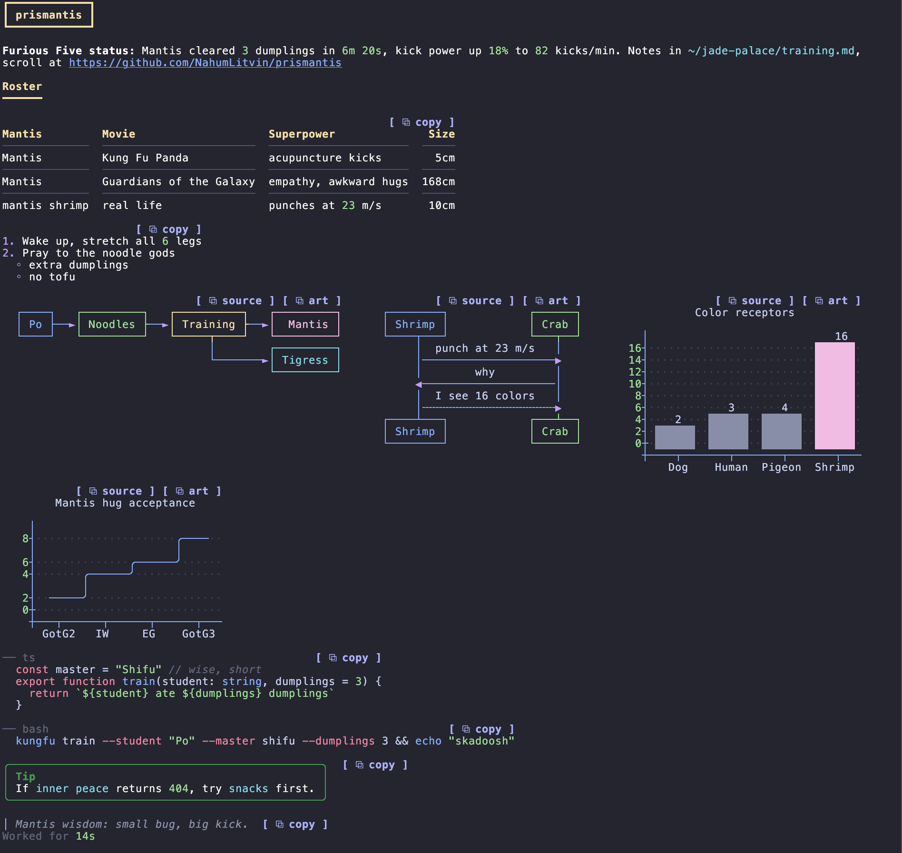

# glint

Colorful, themeable rendering for Claude Code replies, with links and files you can click.

A fork of [prismantis](https://github.com/NahumLitvin/prismantis) by Nahum Litvin (MIT), audited and extended.



## What it draws

- **Markdown, in color**: headings, tables, nested lists, quotes, GitHub alerts, highlighted code in 20+ languages, numbers and paths.
- **Mermaid** flowcharts, sequence diagrams and `xychart-beta` bar and line charts as terminal box art.
- **Copy buttons** on code blocks, tables, diagrams, lists and quotes.
- **Clickable links and files**: a URL or a file path in a reply opens on a click (fullscreen mode): a URL in the browser, a file revealed in Finder. Files Claude created this session are green, edited ones yellow.
- **A link band** above the prompt with every link and file the last reply named, one key or click each.
- **Folding blocks**: code over 24 lines, lists and tables over 14 rows show their start and a `▾ N more` button.
- **Review-style diffs**: ```` ```diff ```` blocks get old and new line numbers, green and red lines, and a `⧉ new only` copy button that takes the code as it is after the change.
- **Right-to-left** Hebrew and Arabic, laid out for the terminal you run.
- 15 themes (`/glint theme <name>`), every color overridable in `/plugin`.

## Install

```sh
claude plugin marketplace add manikosto/glint
claude plugin install glint@glint
```

Needs Claude Code 2.1.289 or later. Turn prismantis off if you have it: two mods drawing replies fight over them.

## Commands

| Command | |
| --- | --- |
| `/glint` | Help and the list of themes |
| `/glint theme <name>` | Switch theme |
| `/glint demo` | Every element on one screen |

## Security

See [SECURITY.md](SECURITY.md). `scripts/verify.sh` rebuilds the vendored bundles from npm and compares their hashes, checks the engine calls against an allow-list, and searches the code for network access.

## License

MIT. Original work © Nahum Litvin; changes © manikosto.
